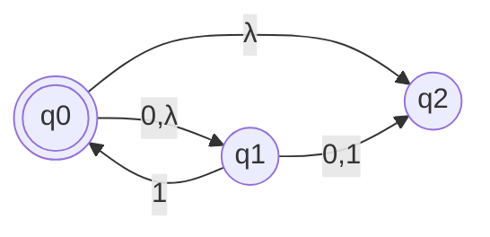
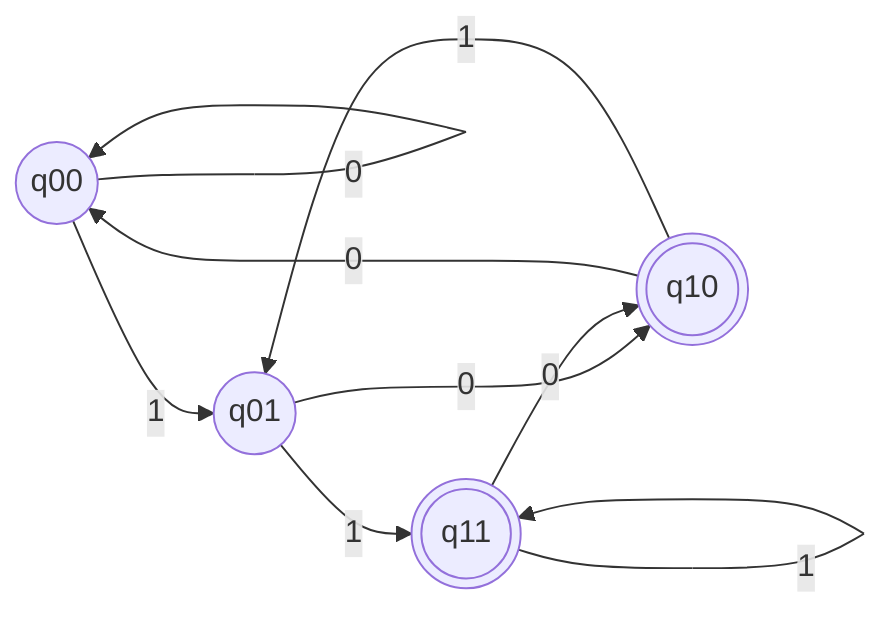
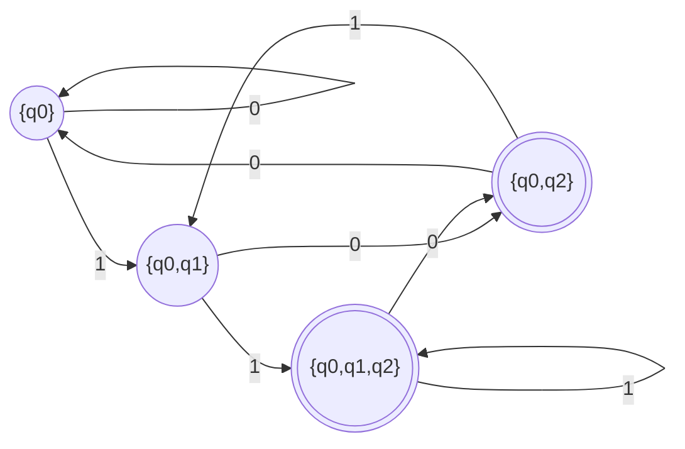
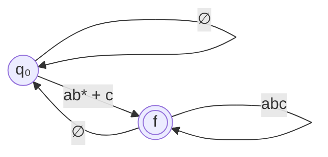
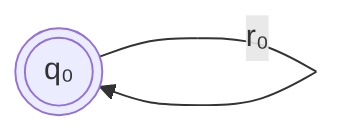
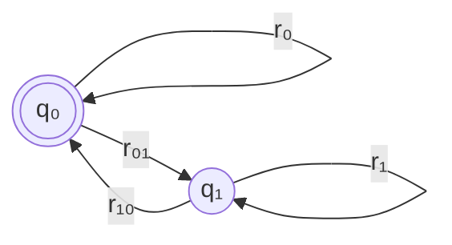
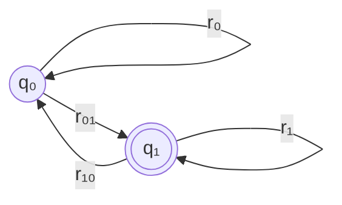

# UofTHacks-X
exploration themed solo attempt?
----------------------------------------------------------------------------------------------------------------------------------------------
 1. Clone into the repository, maintain structure of template folder.

 2. Open the project in the choice of your IDE

 3. Run the Program, it will take a few moments depending on the hardware (the specific line is app.run() on line 33)

 4. IDE Console will generate an IP for a local host server of the type //127.0.0.1:<some number>/, click on this to open it in your browser.

 5. Add a query (activity) and a location where spots for the activity are searched. Click on experience (p.s. I know its cheesy)
  
 6. It will take some amount of time, which can probably be improved with future versions, or better trained models of Co:Here's AI
  
 7. Absence of queries might result in some interesting outputs?

 8. IMPORTANT: line 14 of explor.py contains the trial key given by co:here for the hackathon, if it doesn't work, try a newer key maybe. 
  
 9. Do Not. Try. Offiensive. Or. Profane. Queries.
------------------------------------------------------------------------------------------------------------------------------------------------
# L11

## Converting between NFAs and DFAs



```
δ : Q ⨯ (Σ ∪ {λ}) → P(Q)
For all q ∈ Q, let E(q)
  = set of states reachable from q by following 0 or more λ transitions

E(q₂) = {q₂}
E(q₀) = {q₀, q₂}
E(q₁) = {q₀, q₁, q₂}
```

```
extend δ* to P(Q) ⨯ Σ*
  δ*(Q', x) = ∪{δ*(q, x) | q ∈ Q'}
  for all Q' ∈ P(Q) and x ∈ Σ*
or define recursively
  δ*(Q', λ) = ∪{E(q) | q ∈ Q'}
  for all a ∈ Σ, x ∈ Σ*
  δ*(Q', xa) = ∪{E(q'') | q'' ∈ δ(q', a)
                 for some q' ∈ δ*(Q', x)}
Prove by induction ∀ x ∈ Σ* ∀ y ∈ Σ* ∀ Q' ∈ P(Q)
  δ*(Q', xy) = δ*(δ*(Q', x), y)
```



```
You can get an NFA from a DFA

L(D) = {x ∈ {0,1}* | the second last letter of x is 1}

1. View the DFA as an NFA
   change δ(q, a) = q' to δ(q, a) = {q'} for all q ∈ Q a ∈ Σ
   add δ(q, λ) = Ø
```

## Theorem

For every NFA `N = (Q, Σ, δ, q₀, F)` there is a DFA `D = (Q', Σ, δ', q₀', F')` such that `L(D) = L(N)`.

```
Proof: use generalization

Let N(Q, Σ, δ, q₀, F) be an arbitrary NFA

Construct a DFA that keeps track of the subset of states N could be in as it reads the input

Subset construction
  Let D = (Q', Σ, γ, q₀, F')
  Q' = P(Q)
  q₀' = E(q₀)
  γ(S, a) = ∪{δ*(q, a) | q ∈ S}, S ∈ P(Q), a ∈ Σ
  F' = {S ∈ P(Q) | S ∩ F ≠ Ø}

Prove L(D) = L(N)
  Let p(w) = "γ*(q₀', w) = δ*(q₀, w)" for w ∈ Σ*

  Prove ∀ w ∈ Σ* . p(w) by structural induction

  Base case: w = λ
    γ*(q₀', λ) = q₀' since D is deterministic
    δ*(q₀, λ) = E(q₀) since N is nondeterministic
    By construction q₀' = E(q₀)
    So p(λ) is true
  Constructor case: Let x ∈ Σ*, a ∈ Σ
    Assume p(x) is true
    γ*(q₀', x) = δ*(q₀, λ)
    γ*(q₀, w) = γ(γ*(q₀, x), a)
              = ∪{δ*(q, a) | q ∈ γ*(q₀', x)} by constructor
              = ∪{δ*(q, a) | q ∈ δ*(q₀, x)}
                by induction hypothesis and substitution
              = δ*(q₀, xa) = δ*(q₀, w)
    Hence p(w) is true
  By structural induction ∀ w ∈ Σ* p(w)

  w ∈ L(D) if and only if γ*(q₀', w) ∈ F' since D is a DFA
                          L(D) = {w ∈ Σ* | γ*(q₀', w) ∈ F'}
           if and only if γ*(q₀', w) ∩ F ≠ Ø since
                          F' = {S ∈ P(Q) | S ∩ F = Ø}
           if and only if δ*(q₀, w) ∩ F ≠ Ø since p(w) is true
                          so γ*(q₀', w) = δ*(q₀, w)
           if and only if w ∈ L(N) since L(N) =
                          {w ∈ Σ* | δ*(q₀, w) ∩ F ≠ Ø}
  Hence L(D) = L(N)
```

Example




## Closure Results

```
Suppose L₁ and L₂ ⊆ Σ* are accepted by FA.
Then
  Complement:
    L₁ᶜ = Σ* - L₁ = {x ∈ Σ* | x /∈ L₁}
  Union:
    L₁ ∪ L₂ = {x | (x ∈ L₁) OR (x ∈ L₂)}
  Intersection:
    L₁ ∩ L₂ = {x | (x ∈ L₁) AND (x ∈ L₂)}
  Difference:
    L₁ - L₂ = {x ∈ Σ* | (x ∈ L₁) AND (x /∈ L₂)}
are accepted by FA

The family of languages L = L(M) for some FA
  {L ⊆ Σ* | L is accepted by a FA}
is closed under complement, union, intersection, and difference

PROOF: Let M₁ = (Q₁, Σ, δ, q₁, F₁) be a DFA such that L(M₁) = L₁
       Let M₂ = (Q₂, Σ, δ, q₂, F₂) be a DFA such that L(M₂) = L₂
Without loss of generality, suppose Q₁ ∩ Q₂ = Ø

Let M = (Q, Σ, δ₁, q₁, Q₁, F₁)
Claim: L(M) = Σ* - L(M₁)

Proof:
Let x ∈ Σ* Then x ∈ L(M) if and only if
  δ₁*(q₁, x) ∈ Q₁ - F₁
  iff δ₁*(q₁, x) /∈ F₁
  iff x /∈ L(M₁) = L₁

Note: the construction may not work if M₁ is an NFA
  δ₁*(q₀, x) ∩ (Q₁ - F₁) ≠ Ø } for an NFA
  δ₁*(q₁, x) ∩ F₁ ≠ Ø        } both can be true
```

```
The union, you pretty much have a new q₀ that has two λ arrows that
go into the starting state of each M₁ and M₂
More formally:
  M = (Q₁ ∪ Q₂ ∪ {q₀}, Σ, δ, q₀, F₁ ∪ F₂)
  where q₀ /∈ Q₁ ∪ Q₂
  δ(q₀, λ) = {q₁, q₂}
  δ(q₀, a) = Ø for all a ∈ Σ
  δ(q, a) = {δ₁(q, a)} if q ∈ Q₁ a ∈ Σ
  δ(q, a) = {δ₂(q, a)} if q ∈ Q₂ a ∈ Σ
  δ(q, λ) = Ø for q ∈ Q₁ ∪ Q₂


Intersection, run both machines in parallel, accept only if both accept
L₁ ∩ L₂ = (L₁ᶜ ∪ L₂ᶜ)ᶜ
Formally:
M = (Q ⨯ Q, Σ, δ, (q₁, q₂), F₁ ⨯ F₂)
δ((p₁, p₂), a) = (δ₁(p₁, a), δ₂(p₂, a))
  for all p₁ ∈ Q₁ p₂ ∈ Q₂ a ∈ Σ

Difference:
L₁ - L₂ = L₁ ∩ L₂ᶜ

Concatenation
L₁.L₂ = {x.y | x ∈ L₁ and y ∈ L₂}
if L₁ = {a, bb} K₂ = {λ, c}
L₁.L₂ = {a, ac, bb, bbc}
      ≠ L₂.L₁
L.Ø = Ø = Ø.L
```

The family of languages accepted by FA is closed under concatenation

```
You can view this as making all final states of L₁ pass on λ onto the
initial of L₂

M = (Q₁ ∪ Q₂, Σ, δ, q₁, F₂)
δ(q, a) = {δ₁(q, a)} if q ∈ Q₁
δ(q, a) = {δ₂(q, a)} if q ∈ Q₂
δ(q, λ) = {q₂} if q ∈ F₁
δ(q, λ) = Ø if q ∈ (Q₁ - F₁) ∪ Q₂
```

## Regex Operations
### Positive Closure

```
L₁[1] = L₁
L₁[i + 1] = L₁[i].L₁ = L₁.L₁[i]
L₁+ = union over i ≥ 1 of L₁[i]
  where L[i] = {x₁. ... .xᵢ | x₁ ... xᵢ ∈ L₁}
L₁ = {aab, c}
L₁+ = {aab, c, aabc, caab, cc, aabaab}

L(M) = (a, Σ, q₁, δ, F₁)
  δ(q, a) = {δ₁(q, a)} for q ∈ Q₁, a ∈ Σ
  δ(q, λ) = {q₁} for q ∈ F₁
          = Ø for q ∈ Q₁ - F₁
L(M₁)* = L(M)
```

### Star Closure

```
L₁[0] = {λ} ≠ λ
L₁* = union over i ≥ 0 of L[i] = L₁+ ∪ {λ}
L₁* = L₁+ iff λ ∈ L₁
```

 `L(M)` does not always equal `(L(M₁))*` ! I do not understand the proof or intuition of why

# Regular Expressions

```
Let Σ be a finite alphabet
R is a inductively defined set of strings
Base cases:
  Φ ∈ R, λ ∈ R
  Σ ⊆ R
Constructor cases:
                     { r* ∈ R
  If r, r' ∈ R, then { (r + r') ∈ R
                     { (r.r') ∈ R

R is the set of regular expressions over Σ
If r ∈ R, then L(r) ⊆ Σ*, L : R → P(Σ*)
L(Φ) = Ø
L(λ) = {λ}
L(a) = {a}
L((r + r')) = L(r) ∪ L(r')
L((r . r')) = L(r) . L(r')
L(r*) = (L(r))*

Additionally, generalized regular expressions allow ∩, -, ᶜ
L((r ∩ r')) = L(r) ∩ L(r')
L((r - r')) = L(r) - L(r')
L(rᶜ) = (L(r))ᶜ

We typically don't write `.` and remove `()` where we can

abc + cc means ((a.(b.c)) + (c.c))

A language A is regular if and only if A = L(r) for some r ∈ R
r₁ and r₂ are equivalent if L(r₁) = L(r₂)
```

## Theorem

**Every regular language can be accepted by a FA**. We can confirm this by looking at the structural construction, and equating each to a piece of a finite automata. The constructor case, in particular, has been proved above.

## A few examples of Regular Expressions

- Strings over `{a, b, c}` that start with `ab`
	- `L(a.b.Φᶜ) = L(a.b.(a+b+c)*) ≠ L(a.b.(a.b.c)*)`

# L12
## Quotients of Regular Languages

```
Left quotient of L₁ and L₂
  L₂ \ L₁ = {y | ∃ x ∈ L₂ . (xy ∈ L₁)}
Right quotient of L₁ and L₂
  L₁ / L₂ = {y | ∃ x ∈ L₂ . (xy ∈ L₁)}

If L₁ and L₂ are regular, so is L₂ \ L₁ and L₁ / L₂
Let M₁ = (Q₁, Σ, δ₁, q₁, F₁) and M₂ = (Q₂, Σ, δ₂, q₂, F₂)
  be DFAs such that L₁ = L(M₁) and L₂ = L(M₂)

L₁ = {0ⁱ1ʲ | i, j ∈ ℕ}
L₂ = {0ⁱ1 | i ∈ ℕ}
L₂ \ L₁ = {1ⁱ | j ∈ ℕ}

---

Let M = (Q, Σ, δ, (q₁, q₂), F₁) where Q = Q₁ ⨯ Q₂ ∪ Q₁

For all q ∈ Q₁, p ∈ Q₂
δ((q, p), λ) = {(δ₁(q, a), δ₂(p, a)) | a ∈ Σ} ∪ {q | p ∈ F₂}
δ((q, p), a) = ∅ for all a ∈ Σ 

For all q ∈ Q₁
δ(q, a) = {δ₁(q, a)}
  (Note the curly braces, because we're now dealing with an NFA)
δ(q, λ) = ∅

Now we have to prove that L(M) = L₂ \ L₁
Let y ∈ L₂ \ L₁. Then ∃ x ∈ L₂ such that xy ∈ L₁
In M₂ there is a path from q₂ to a state q ∈ F₂ labelled by x
In M₁ there is a path from q₁ to δ₁*(q₁, x) = p
In M₁ ⨯ M₂ (or Q₁ ⨯ Q₂, the set of pairs of states) there is a path
  from (q₁, q₂) to (q, p) labelled by λ (By construction)
Since p ∈ F₂ there is a λ-transistion from (q, p) to q
  (By construction)
Since xy ∈ L₁, δ₁*(q, y) = δ₁*(δ₁*(q₁, x), y)
                         = δ₁*(q₁, xy) ∈ F₁
So y ∈ L(M)

Conversely, suppose y ∈ L(M).
Then there is a path from (q₁, q₂) to a state q' ∈ F₁ that is
  labelled by y
The only way to get from Q₁ ⨯ Q₂ to Q₁ is by a λ-transition from a
  state (q, p) ∈ Q₁ ⨯ Q₂ to q ∈ Q₁ where p ∈ F₂
All the edges between states in Q₁ ⨯ Q₂ are labelled by λ
So by definition of δ, there exists a string x ∈ Σ* such that
  q = δ₁*(q₁, x) and p = δ₂*(q₂, x).
Since p ∈ F₂, x ∈ L(M₁) = L₁
Edges between states in Q₁ are labelled by letters, so
  δ₁*(q, y) = δ*(q, y) = q' ∈ F₁
  δ₁*(q, xy) = δ₁*(δ'(q₁, x), y)) = δ₁* = q' ∈ F₁ so xy ∈  L₁ 
Hence y ∈ L₂ \ L₁

NOTE: there's a mistake in the diagram of this in the textbook
      online. a state is labelled as final when it shouldn't be
```

## Generalized Transition Graph (GTG)

```
A GTG is a 5-tuple G = (Q, Σ, δ, q₀, f)
 - Q is a finite set of state
 - Σ is a finite alphabet
 - q₀ ∈ Q
 - f ∈ Q is a *single* final state, not a set

δ : Q ⨯ Q' → R, where R is the set of regular expressions
  over Σ.
```


```
In the above example, the empty set means you canont follow that path
because there is no string that allows that. This is required by the definition, however.
L(Q) = {x ∈ Σ* | there is a path from q₀ to f and x is in the language
        described by the concatenation of the labels on the edges of
        the path}
```

```
**Lemma**
For any NFA M = (Q, Σ, δ, q₀, F) there is a GTG
  G = (Q ∪ {f}, Σ, δ', q₀, f}) that L(M) = L(G)

We can construct the single finite state by making λ-transitions
  from every final state in F to f, and making ∅-transitions from f
  to everything else.

**Theorem**
For every GTG G, there is a regular expression r such that
  L(G) = L(r)

Proof by induction on the number of states in G
P(n) = "For every GTG G with n states there is a regular
        expression r such that L(G) = L(r)"

n = 1, L(G) = L(r₀*)
```

```
n = 2,  L(r) = L(G)
Figure 1: r = (r₀ + r₀₁ r₁* r₁₀)*
Figure 2: r = r₀* r₀₁ . (r₁₀ r₀* r₀₁ + r₁)*
```


```
Proof is in the textbook, but the intuition is as follows:
Let n ≥ 3, and assume P(n - 1)
G = (Q, Σ, δ, q, f)
Let qₓ ∈ Q - {q₀, f}  # state to be removed, not initial or final
G' = (Q', Σ, δ', q₀, f) where Q' = Q - {qₓ}
δ' is defined as follows:
  ...
G' has n -1 states
Let qᵢ, qⱼ ∈ Q'
  ...
  Show that removing a state lets you retain transitions on the states
  it was attached to. Using * quantifier, it's actually pretty easy.
  The example used here was from 3 states down to 2, which is a good
  execise to derive yourself with arbitrary transition regular
  expressions.
  ...

Claim:

For all q, q' ∈ Q and all x ∈ Σ*, there is a path from q to q' labelled
by r in G such that x ∈ L(r)
... something else I missed
```

## Important relations

The family of languages defined by DFAs are the same as NFAs, are the same as Regular languages, are the same as GTGs.
